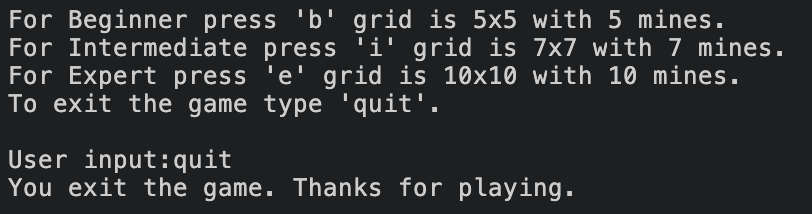

# Minesweeper

Minesweeper is a classic and popular online puzzle single player game. It is all age appropriate. This is not the classic version, which offers clues with numbers of neighboring mines. The outcome depends on random events, to clear the board without detonating any mines.
The game begins with introduction to the game rules and selection of a difficulty level, beginner internediate or expert, which is based on the grid size. 

Once selected the difficulty level, it renders a board with the hidden cells all marked with '0'. The user is prompted to choose a cell to dig, by giving an input, according to the
row and column number. If correct and no mine was detonated, a message will indicate to 
continue with new location to dig and the board, will be rendered with the cleared cell,
marked with '-'. However, if the user guesses incorrectly, there will be rendered a message
for hitting a mine. All difficulty levels are given three lives, so the user will be propted
to choose to continue the game or quit. In ordered to win the player has to clear the board,
before running out of lives.

Minesweeper is an interesting and familiar game, that keeps the player engaged, based on simple guessing skills. It is a great way to have some fun and mine-out!

## Home

## Table of Contents
1. [How to play](##how-to-play)
2. [Flowchart](#flowchart)
3. [User Experience](#user-experience)
4. [Features](#features)
- [Existing Features](#existing-features)
- [Features Left to Implement](#features-left-to-implement)
5. [Technologies](#technologies)
6. [Frameworks, Libraries & Programs](#frameworks,-libraries-&-programs)
7. [Testing](#testing)
8. [Manual Testing](#manual-testing)
9. [Input validation testing](#input-validation-testing)
10. [Fixed Bugs](#fixed-bugs)
11. [Deployment](#deployment)
- [Heroku](#heroku)
- [Fork](#fork)
- [Clone](#clone)
12. [Credits](#credits)

## How to play

In this implementation of Minesweeper you will be prompted to
choose a difficulty level, based on the grid size. The computer will
render a board either 5x5, 7x7 or 10x10 accordingly the level diffuculty,
and randomly distribute mines, corresponding their number to the grid size.
You will have to guess all the coordinates, avoiding to step on the mines,
to clear the board without detonating any mines and win the game.

## Logic Flowchart

## User Experience

Minesweeper is a classic game, this version is presented very minimal,
with basic board created by the hidden cells all marked with a '0'.
On the left side of the board there are the numbers from 0 to the number
size of the grid minus one, corresponding on the difficulty level, separated
by dashed line - representing the rows, and the columns are numbered the same
way on the top of the board, again separated by a dashed line. The numbers
are the main guide for the user to input the coordinates of the choosen cell.
Once a valid input is given the board is printed again, updated with either a
'-' for non-mined cell or the '*' hitting one. The user is given three lives
each game and can continue, after stepping on a mine, till running out of 
lives or winning the game. The game is very easy to follow and have fun.

- First time user
    - Follow the rules
    - Play the game
    - Have fun
- Returning user
    - Continue playing
    - Change difficulty
    - Share with friends
- Frequent user
    - Explore new features

## Features

### Existing Features

- Render welcome message and display rules, choose difficulty level

- Beginner board

- Intermediate board

- Expert board

- Exit before playing the game

- Type coordinates to dig

- Cleared cell, type coordinates to continue digging

- Stepped on a mine, lost a life, do you wish to continue

- Stepped on a mine, play again?

- Stepped on the same mine free coordinates

- Stepped on the same coordinates with a mine

- Game over, play again?

- Game over, play again?

- You win, play agin?

## Features Left to Implement
- timer recording the time taken to finish the game
- numbers of neighboring mines
- flag potential mine location

## Technologies
- Python
## Frameworks, Libraries & Programs
- [Codeanywhere](https://codeanywhere.com/)
    - To write the code
- [VS Code](https://code.visualstudio.com/)
    - Manual testing
- [Git](https://git-scm.com/)
    - Version control
- [Github](https://https://github.com/)
    - Deploy project
- 	[Draw.io](https://app.diagrams.net/)
    - Create a flowchart
- [Heroku](https://heroku.com/)
    - Deploy with command-line
- [CI Python Linter](https://pep8ci.herokuapp.com/)
    - Check style conventions in PEP 8
## Testing
- CI Python Linter used to test run.py
## Manual Testing

The game was manually tested in VS Code, Codeanywhere and Heroku.

| TEST                          | EXPECTED                        | PASS | FAIL |
| ----------------------------- | ------------------------------- | ---- | ---- |
| Select difficulty or exit     | Retrieve a letter or word       | YES  |      |
| Choose coordinates            | Integers separated by comma     | YES  |      |
| Cleared cell,type coordinates | Integers separated by comma     | YES  |      |
| Stepped on a mine, continue   | Retrieve a letter               | YES  |      |
| Same coords on empty cell     | Send message again              | YES  |      |
| Same coords on mine           | Send message again              | YES  |      |
| Game over, play again?        | Retrieve a letter               | YES  |      |
| Game over, play again? new    | Retrieve a letter or word       | YES  |      |
| You win, play agin?           | Retrieve a letter               | YES  |      |

## Input validation testing

- Render welcome message and display rules
    - Choose diffuculty level or exit the game
    - Cannot continue with empty input
    - Must be 'b', 'i', 'e' or 'quit'

- Type coordinates to dig
    - Cannot continue with empty input
    - Must be integers from zero to grid size minus one separated with a comma

- Cleared cell, type coordinates to continue digging
    - Cannot continue with empty input
    - Must be integers from zero to grid size minus one separated with a comma

- Stepped on a mine, lost a life, do you wish to continue
    - Cannot continue with empty input
    - Must be 'y' or 'n'

- Stepped on a mine, play again?
    - Cannot continue with empty input
    - Must be 'y' or 'n'

- Stepped on the same mine free coordinates
    - Cannot continue with empty input
    - Must be integers from zero to grid size minus one separated with a comma

- Stepped on the same coordinates with a mine
    - Cannot continue with empty input
    - Must be integers from zero to grid size minus one separated with a comma

- Game over, play again?
    - Cannot continue with empty input
    - Must be 'y' or 'n'

- Game over, play again?
    - Cannot continue with empty input
    - Must be 'y' or 'n'

- You win, play agin?
    - Cannot continue with empty input
    - Must be 'y' or 'n'

## Fixed Bugs
- Negative integers were considered in the play function in order to
raise ValueError, if given unrelevant input
- User input in the recursive validation function was set to lower to
to avoid case sensitive bugs and give the better user experience

## Deployment
- Heroku
    - Log in to Heroku and click New, then select Create new app.
    - Choose an app name and select your region, then click Create app.
    - Find Settings on the next page, then Config Vars.
    - Click Reveal Config Vars and add PORT key and value of 8000
    - Scroll down to find Buildpack and click Add, select Python
    - Scroll down add Node.js, then Python
    - Top of the page select Deploy tab
    - choose GitHub deployment method and link your repo
    - Scroll down, choose Enable Automatic Deploys or Manual Deploy
- Fork
    - Find [Minesweeper](https://github.com/vikdts/milestone-project-three) github repository
    - Under the main navigation, the Fork button is located second to last on the right.
    - You have personal copy of the original repository in your GitHub account now.
- Clone
    - Find [Minesweeper](https://github.com/vikdts/milestone-project-three) github repository
    - Click the Code button, copy the local clone with HTTPS, SSH or GitHub CLI.
    - Open the terminal and change the directory to the desired destination for clone repo.
    - Type git clone and paste the copied URL then press enter to create the local clone.
## Credits
- Code Institue Lessons
- MDN python documentation
